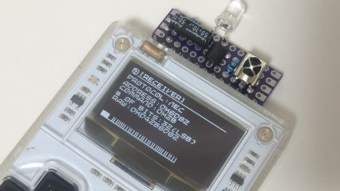
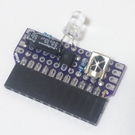
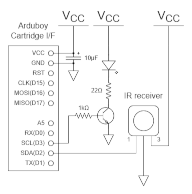

# ArduboyIRController

An IR remote controller using remodeled Arduboy.

In addition, IR signal analyzing function is available.

 (Click to expand)

## Instruction

Control      |Function
-------------|-------------------------------
Left / Right |Change target device
Up / Down    |Choose a signal to send
B button     |Send a signal
A button     |Toggle mode (sender / receiver)

Current sketch is optimized for my home. You should modify "[table.h](table.h)".

The remote controllers in my home:

* CL-RL2 (for ceiling light, Iris Ohyama)
* RE2028 (for ceiling light, NEC)
* HK9327K (for ceiling light, Panasonic)
* RM-JD022 (for TV, Sony)
* RMT-VR502J (for BD/HDD recorder, Sony)
* RMT-VB101J (for BD player, Sony)
* XQS-X610 (for electric fan, Plus Minus Zero)

## Hardware

You have to remodel an Arduboy and build an expansion cartridge.

### Components

* IR LED: [OSI5FU5111C-40](https://akizukidenshi.com/catalog/g/gI-03261/)
* NPN transistor (hFE 280&ndash;560): [2SC536-G](http://akizukidenshi.com/catalog/g/gI-13824/)
* IR receiver module: [OSRB38C9AA](https://akizukidenshi.com/catalog/g/gI-04659/)
* Electrolytic capacitor: 10&micro;F
* Resistors: 1k&ohm;&times;1, 22&ohm;&times;1
* Pin socket (1&times;12)
* Etc...

### Schematic

 (Click to expand)

## Software 

### Build environment

Clone or download this repository and open the project file "ArduboyIRController.ino" with Arduino IDE.

This sketch depends on following libraries. (You can add these by library manager)

* [Arduboy2](https://github.com/MLXXXp/Arduboy2) version 6.0.0
* [IRremote](https://github.com/Arduino-IRremote/Arduino-IRremote) version 3.9.0

### License

These codes are licensed under [MIT License](LICENSE).

## References

* About expansion connector of Arduboy
  * [Flash cart(ridge) &ndash; Arduboy Community](https://community.arduboy.com/t/flash-cart-ridge/5840)
  * [Flash Cart について &ndash; Arduboy Community](https://community.arduboy.com/t/flash-cart/6647)
  * [Arduboy FlashCartの紹介 &ndash; inajob's blog](https://inajob.hatenablog.jp/entry/arduboy-flashcart)
  * [Arduboy FlashCart &ndash; OBONO's Diary](https://obono.hateblo.jp/entry/20200509/1589034660)
* About IR signal
  * [赤外線LEDの使い方（リモコン） &ndash; 電子うさぎ](https://xn--p8jqu4215bemxd.com/archives/13164)
  * [Arduinoで赤外線リモコンの値を読み取り、送信する方法 &ndash; 試行錯誤な日々](https://asukiaaa.blogspot.com/2018/05/arduino.html)
  * [パナソニックの照明を制御する &ndash; プログラミングな日々](https://days-of-programming.blogspot.com/2017/05/blog-post.html)
  * [LEDシーリングライト用赤外線リモコンの製作(1)アイリスオーヤマ用 &ndash; wsnakのブログ](http://www.wsnak.com/wsnakblog/?p=1461)
